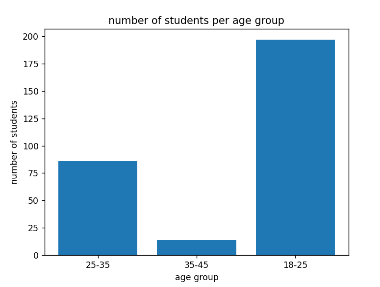
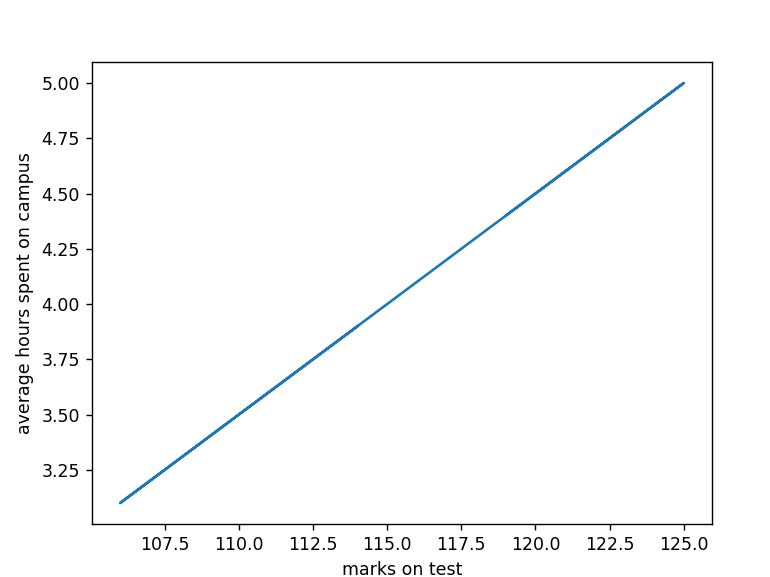
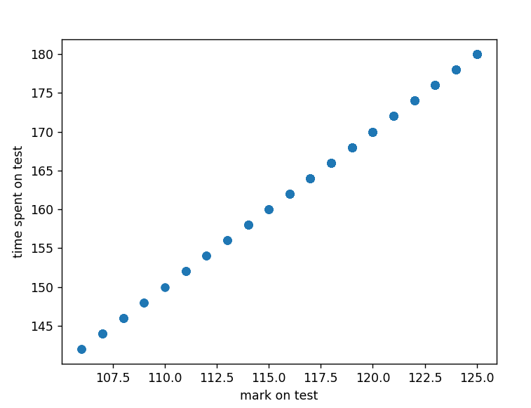
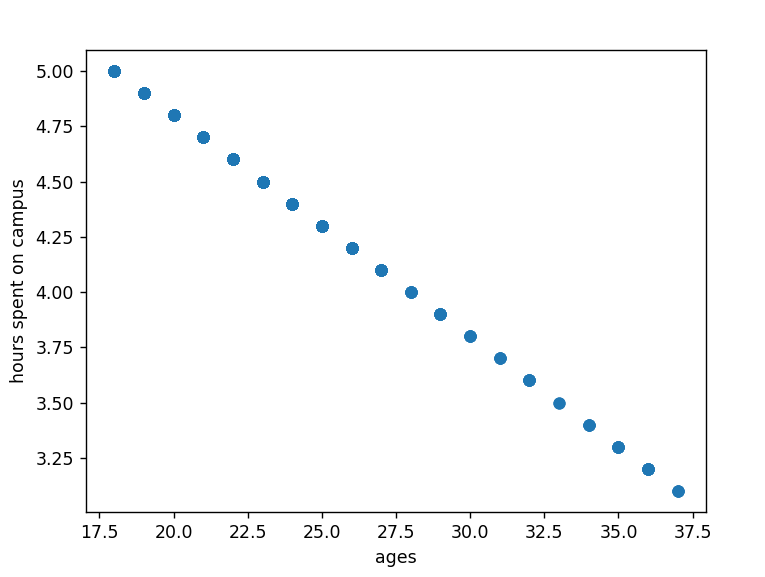

# Python for Data Science Project
#### dv.2022.c4h2t2 <br/> Pieter Malan

## Introduction

The purpose of this project is to create and capture data surrounding university examinations and display them visually using graphs and statistics to be able to draw conclusions from the visual data to be able to make better future decisions and improvements.

## Q1 - First Steps 

First we need data to work with so I created the datasets using the python `random` library to create the records and store it in a csv file for processing in question 2. The code for this is located in `question1.py`

```python
import pandas as pd
import random

for i in range(1,3):
    studentNum = []
    age = []
    hours = []
    mark = []
    percentage = []
    timeTaken = []

    counter = 0 # count student numbers
    for i2 in range(150):
        counter += 1

        # student number
        studentNum.append(counter)
        
        # age
        age.append(random.randint(18,50))

        # average hours on campus
        hours.append(random.randint(1,5))

        # student marks and calculate percentage
        x = random.randint(50,130)
        mark.append(x)
        x = round(int(x)/130*100, 2)
        percentage.append(x)
        
        # students time taken on the test
        timeTaken.append(random.randint(100,180))

    # save the records in the csv files
    df = pd.DataFrame({"student_num": studentNum, "age": age, "average_hours": hours, "mark": mark, "percentage": percentage, "time_taken": timeTaken})
    df.to_csv('exam'+str(i)+'.csv')
```

## Q2 - Seeing the data visually

In this part of the project we have to read the datasets and display the information visually so we can make conclusions for question 3. First we read the csv files and then display certain information such as the average hours spent on campus for each student, the age of each student and the test mark result for each student. Then we plot these data on graphs: number of student per age group, student test marks in relationship with how much hours on average they have spent on campus, their test mark in relationship with how much time they spent writing the test and then their age compared to how many hours on average that they spent on campus. The code for this is located in `question2.py`

## Q3 - Making conclusions from the graphs

```python
import pandas as pd
import numpy as np
from matplotlib import pyplot as plt

# read the csv files
df1 = pd.read_csv('exam1.csv')
df2 = pd.read_csv('exam2.csv')
data = pd.concat([df1, df2])

# create frequency tables
frequency = {"Average hours on campus": {}, "Student age": {}, "Student mark": {}}

# average hours 
for value in data['average_hours']:
    if str(value) in frequency['Average hours on campus']:
        frequency['Average hours on campus'][str(value)] = frequency['Average hours on campus'][str(value)] + 1
    else:
        frequency['Average hours on campus'][str(value)] = 0

# age
for value in data['age']:
    if value >= 18 and value <= 25:
        value = "18-25"
    elif value >= 25 and value <= 35:
        value = "25-35"
    elif value >= 35 and value <= 45:
        value = "35-45"
    elif value >= 45:
        value = "over 45"

    if str(value) in frequency['Student age']:
        frequency['Student age'][str(value)] = frequency['Student age'][str(value)] + 1
    else:
        frequency['Student age'][str(value)] = 0

# mark
for value in data['mark']:
    if str(value) in frequency['Student mark']:
        frequency['Student mark'][str(value)] = frequency['Student mark'][str(value)] + 1
    else:
        frequency['Student mark'][str(value)] = 0

#print(frequency)

# display bar chart for amount of students per age group
"""
age_groups = []
ages = data['age'].tolist()
ages.sort()

for age in ages:
    if age >= 18 and age <= 25:
        age_groups.append('18-25')
    elif age >= 25 and age <= 35:
        age_groups.append('25-35')
    elif age >= 35 and age <= 45:
        age_groups.append('35-45')
    elif age >= 45 and age <= 50:
        age_groups.append('over 45')
    else:
        print(age)
"""
plt.bar(frequency['Student age'].keys(), frequency['Student age'].values())
plt.title('number of students per age group')
plt.xlabel('age group')
plt.ylabel('number of students')
plt.show()
exit()

# display line chart for student test marks against how many hours they spend on campus average
marks = data['mark']
average_hours = data['average_hours']
plt.xlabel('marks on test')
plt.ylabel('average hours spent on campus')
plt.plot(marks, average_hours)
plt.show()

# display graphs for how many marks students get on test against how much time they spent writing the test
marks = data['mark']
time_taken = data['time_taken']
plt.xlabel('mark on test')
plt.ylabel('time spent on test')
plt.scatter(marks, time_taken)
plt.show()

# display graph for how old the students are compared to how much time they spend on campus
ages = data['age']
average_hours = data['average_hours']
plt.xlabel('ages')
plt.ylabel('hours spent on campus')
plt.scatter(ages, average_hours)
plt.show()
```


From the first graph we can tell that the majority of students is found between the ages of 35 and 45.


The second graph tells us that the more time students spent on campus studying the higher their test marks were. 


Graph 3 tells us that the more time they spent writing the test, the higher their marks were


and lastly the graph 4 showed us that students who are older spent less time on campus than students who were younger.

## Q4

From the graphs in question 4.5 we can tell that the there was a increase in percentage of women who earned a degress in all majors between 1970 and 1980. From 1980 onwards there was a decrease in percentage at Computer Science, an increase in Maths and Statistics, a heavy increase in Physical Sciences and a slow increase in Engineering. From the year 2005 and moving forward all majors have seen a slight decrease in percentages except for Computer Science which dropped heavily from 2001 until 2006